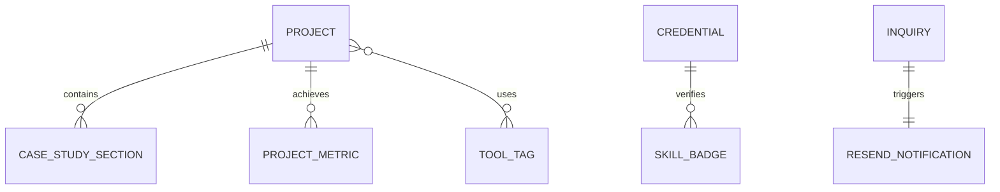

# Backend Schema & Data Architecture

## 1. Data Overview

**Data Architecture:** Statically typed Headless Content Architecture with a Serverless Ingestion Pipeline.

**Main Data Domains:**
- **Projects & Case Studies:** Structured local TypeScript collection storing all 12 projects (7 UI/UX and 5 Graphic Design) with rich case study sections.
- **Credentials & Certifications:** Verification records for Diploma in Computer Engineering, 12th Science stream, and Xipra Tech certifications.
- **Inquiries (Leads):** Contact form submission data payload validated and dispatched via Resend.
- **Ownership Model:** Content authored and owned statically by Bilal; inquiry records dispatched directly to Bilal’s private email with optional persistence in a serverless database (Supabase or Vercel KV).

## 2. Authentication and Authorisation
- Public access (Read-Only) for all projects, credentials, and portfolio content.
- Serverless API route (`/api/contact`) protected by rate-limiting middleware and honeypot validation. No user passwords or sessions required.

## 3. Schemas and Type Definitions

### 3.1 Project Entity Schema (Project)
Stored in `data/projects.ts` as a strongly typed TypeScript array.

```typescript
export type ProjectCategory = 'ui-ux' | 'graphic-design';

export interface ProjectMetric {
  label: string;
  value: string;
  description?: string;
}

export interface CaseStudySection {
  id: string;
  title: string;
  subtitle?: string;
  content: string; // Markdown or rich HTML formatted string
  images?: {
    url: string;
    caption: string;
    alt: string;
    aspectRatio?: '16:9' | '4:3' | '1:1';
  }[];
  callout?: {
    type: 'insight' | 'engineering' | 'result';
    text: string;
  };
}

export interface Project {
  id: string;                  // Unique identifier (e.g. 'proj-01')
  slug: string;                // URL slug (e.g. 'fintech-crypto-wallet')
  title: string;               // Display title
  subtitle: string;            // One-line teaser
  category: ProjectCategory;   // 'ui-ux' or 'graphic-design'
  featured: boolean;           // Display in hero featured slot
  sortOrder: number;           // 1 to 12
  timeline: string;            // e.g. '3 Weeks, 2024'
  role: string;                // e.g. 'Lead UI/UX Designer & Prototyper'
  client: string;              // e.g. 'Academic Project / Concept / Client'
  tools: string[];             // e.g. ['Figma', 'Illustrator', 'Design System']
  thumbnailUrl: string;        // Cover image for project grid
  heroImageUrl: string;        // Full-width banner in case study
  figmaPrototypeUrl?: string;  // Embeddable Figma prototype link
  liveDemoUrl?: string;        // Optional live web link
  metrics?: ProjectMetric[];   // Key outcomes or achievements
  overview: string;            // High-level summary
  sections: CaseStudySection[];// Detailed process blocks
  engineeringNotes?: string;   // How Bilal's computer engineering mindset helped build it
}
```

### 3.2 Credential & Education Schema (Credential)
Stored in `data/credentials.ts`.

```typescript
export interface Credential {
  id: string;
  title: string;
  institution: string;         // e.g. 'Xipra Tech' | 'Gujarat Technological University / Board'
  credentialType: 'certification' | 'diploma' | 'academics';
  issueDate: string;           // e.g. '2024'
  credentialId?: string;       // Certificate ID
  verificationUrl?: string;    // URL to view certificate
  skillsAcquired: string[];    // e.g. ['User Flows', 'Wireframing', 'Typography']
  description: string;
}
```

### 3.3 Contact Inquiry Schema & Zod Validation (Inquiry)
```typescript
import { z } from 'zod';

export const InquirySchema = z.object({
  name: z
    .string()
    .min(2, { message: 'Name must be at least 2 characters long.' })
    .max(80, { message: 'Name must be under 80 characters.' })
    .trim(),
  email: z
    .string()
    .email({ message: 'Please provide a valid email address.' })
    .toLowerCase()
    .trim(),
  projectType: z.enum([
    'UI/UX Design',
    'Graphic Design & Branding',
    'Full-Time Opportunity',
    'Consultation / Other'
  ]),
  budget: z.string().optional(),
  message: z
    .string()
    .min(15, { message: 'Please share a brief message (at least 15 characters).' })
    .max(2000, { message: 'Message cannot exceed 2000 characters.' })
    .trim(),
  _gotcha: z.string().max(0, { message: 'Spam bot detected.' }) // Honeypot field
});

export type InquiryInput = z.infer<typeof InquirySchema>;
```

## 4. Entity Relationships



- **Project to CaseStudySection:** One-to-Many. Each project contains multiple structured story blocks.
- **Project to Category:** Many-to-One. Exactly 12 projects mapped into either `ui-ux` (7) or `graphic-design` (5).
- **Inquiry to Resend:** One-to-One. Each validated inquiry triggers an email notification.

## 5. Access Rules & Security Matrix

| Entity | Public Read | Public Create | Public Update | Public Delete |
|---|---|---|---|---|
| Project | Yes (Static) | No | No | No |
| Credential | Yes (Static) | No | No | No |
| Inquiry | No | Yes (via `/api/contact` with rate limit) | No | No |

## 6. Core Data Operations
- `getAllProjects()`: Retrieves all 12 projects sorted by `sortOrder` ascending.
- `getProjectsByCategory(category: ProjectCategory)`: Filters projects by `ui-ux` or `graphic-design`.
- `getProjectBySlug(slug: string)`: Retrieves a single project record by its unique URL slug. Throws Next.js `notFound()` if slug does not match.
- `submitInquiry(payload: InquiryInput)`: Validates payload against `InquirySchema`, checks honeypot, dispatches email via Resend SDK.

## 7. File Storage and Media Organization
Assets are structured in `public/`:

```
public/
├── resume/
│   └── Bilal_Mahesaniya_Resume.pdf
├── credentials/
│   ├── xipra-tech-uiux-certificate.webp
│   └── xipra-tech-graphic-design-certificate.webp
└── projects/
    ├── p-01/
    │   ├── thumbnail.webp
    │   ├── hero.webp
    │   ├── wireframes.webp
    │   └── ui-screens.webp
    ├── p-02/
    │   └── ...
    └── ... (up to p-12)
```

## 8. Seed Data: Bilal's 12 Projects Manifest
Includes 7 UI/UX projects (`p-01` through `p-07`) and 5 Graphic Design projects (`p-08` through `p-12`).

## 9. Data Integrity and Validation
All project data is strictly validated at build time via TypeScript interfaces.
Contact form payloads are strictly validated on the server via `InquirySchema.safeParse(body)`.
